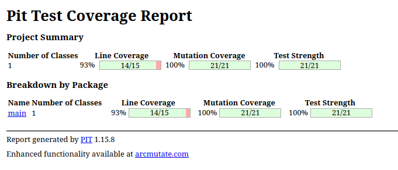

# Balanced strings

A string containing grouping symbols `{}[]()` is said to be balanced if every open symbol `{[(` has a matching closed symbol `)]}` and the substrings before, after and between each pair of symbols is also balanced. The empty string is considered as balanced.

For example: `{[][]}({})` is balanced, while `][`, `([)]`, `{`, `{(}{}` are not.

Implement the following method:

```java
public static boolean isBalanced(String str) {
    ...
}
```

`isBalanced` returns `true` if `str` is balanced according to the rules explained above. Otherwise, it returns `false`.

Use the coverage criteria studied in classes as follows:

1. Use input space partitioning to design an initial set of inputs. Explain below the characteristics and partition blocks you identified.
2. Evaluate the statement coverage of the test cases designed in the previous step. If needed, add new test cases to increase the coverage. Describe below what you did in this step.
3. If you have in your code any predicate that uses more than two boolean operators, check if the test cases written so far satisfy *Base Choice Coverage*. If needed, add new test cases. Describe below how you evaluated the logic coverage and the new test cases you added.
4. Use PIT to evaluate the test suite you have so far. Describe below the mutation score and the live mutants. Add new test cases or refactor the existing ones to achieve a high mutation score.

Write below the actions you took on each step and the results you obtained.
Use the project in [tp3-balanced-strings](../code/tp3-balanced-strings) to complete this exercise.

## Answer

### 1 -

- **Test 1 :** Chaîne contenant uniquement des symboles de regroupement. (`"()[]{}"` , `"{[()]}"`)
- **Test 2 :** Chaîne contenant des symboles de regroupement et d’autres caractères. (`"a(b)c"` , `"{a[b(c)d]e}"`)
- **Test 3 :** Chaîne ne contenant aucun symbole de regroupement (inclut la chaîne vide).  (`""` , `"abcde"`)
- **Test 4 :** Chaîne contenant uniquement des parenthèses `()`. (`"((()))"`)
- **Test 5 :** Chaîne contenant uniquement des crochets `[]`. (`"[[[]]]"`)
- **Test 6 :** Chaîne contenant uniquement des accolades `{}`. (`"{{{}}}"`)
- **Test 7 :** Chaîne contenant une combinaison de différents types de symboles `()[]{}`. (`"{[]()}"`)
- **Test 8 :** Symboles correctement appariés et imbriqués. (`"{[()]}"`)
- **Test 9 :** Symboles correctement appariés mais non imbriqués. (`"()[]{}"`)
- **Test 10 :** Symboles mal appariés ou mal imbriqués. (`"([)]"`, `"{(}{}"`)
- **Test 11 :** Symboles d’ouverture sans correspondance de fermeture. (`"((("`, `"{{"`)
- **Test 12 :** Symboles de fermeture sans correspondance d’ouverture. (`")))"`, `"}}"`)
- **Test 13 :** Chaîne vide. (`""`)
- **Test 14 :** Chaîne de longueur paire. (`"()[]{}"`)
- **Test 15 :** Chaîne de longueur impaire. (`"({})("`)
- **Test 16 :** Chaîne `null`. (`null`)
- **Test 17 :** Chaîne contenant uniquement des symboles d’ouverture. (`"((("`, `"[["`, `"{{{"`)
- **Test 18 :** Chaîne contenant uniquement des symboles de fermeture. (`")))"`, `"]]"`, `"}}}"`)


### 2 -

### **Instructions Couvertes par les Tests Existants**

En analysant les cas de test, nous constatons que :

- **Toutes les instructions conditionnelles** (comme les vérifications de symboles d'ouverture et de fermeture) sont couvertes par au moins un cas de test.
- **Les branches de retour** (`return false` et `return true`) sont également couvertes.
- **Les appels à `isMatchingPair`** sont testés avec des paires correspondantes et non correspondantes.
- **Les scénarios de chaîne `null`, vide, avec uniquement des symboles d'ouverture ou de fermeture, et avec des symboles imbriqués correctement ou incorrectement** sont tous testés.


### 3 - 

### **Prédicats dans la Méthode `isBalanced`**

1. **Vérification des Symboles d'Ouverture :**
   ```java
   if (c == '(' || c == '{' || c == '[')
   ```
    - **Conditions de base :**
        - `c == '('`
        - `c == '{'`
        - `c == '['`

2. **Vérification des Symboles de Fermeture :**
   ```java
   else if (c == ')' || c == '}' || c == ']')
   ```
    - **Conditions de base :**
        - `c == ')'`
        - `c == '}'`
        - `c == ']'`

### **Prédicat dans la Méthode `isMatchingPair`**

```java
return (open == '(' && close == ')') ||
       (open == '{' && close == '}') ||
       (open == '[' && close == ']');
```

- **Conditions de base :**
    - `(open == '(' && close == ')'`
    - `(open == '{' && close == '}'`
    - `(open == '[' && close == ']'`

## **Ajout de Cas de Test pour Assurer une Couverture BCC Complète**

Même si la couverture BCC semble être couverte par les tests existants, pour renforcer les tests, ajoutons quelques cas supplémentaires qui ciblent explicitement certaines conditions.

## **Mise à Jour des Cas de Test**

```java
// Nouveau Cas de Test 19 : Paires avec Types Mélangés mais Non Correspondants
@Test
void testMixedNonMatchingPairs() {
    // open == '(' mais close != ')'
    assertFalse(isBalanced("(]"), "Paire '(' avec ']' ne doit pas être équilibrée.");
    
    // open == '{' mais close != '}'
    assertFalse(isBalanced("{)"), "Paire '{' avec ')' ne doit pas être équilibrée.");
    
    // open == '[' mais close != ']'
    assertFalse(isBalanced("[}"), "Paire '[' avec '}' ne doit pas être équilibrée.");
}

// Nouveau Cas de Test 20 : Paires avec Symboles de Fermeture Incorrects au Milieu
@Test
void testIncorrectClosingSymbolsInMiddle() {
    // Chaîne avec une fermeture incorrecte au milieu
    assertFalse(isBalanced("{[}(])}"), "Chaîne avec fermeture incorrecte au milieu ne doit pas être équilibrée.");
}

// Nouveau Cas de Test 21 : Symboles d'Ouverture Non Correspondants suivis de Fermeture
@Test
void testUnmatchedOpeningAndClosingSymbols() {
    // Plusieurs symboles d'ouverture sans fermetures correspondantes
    assertFalse(isBalanced("({["), "Chaîne avec multiples symboles d'ouverture sans fermetures ne doit pas être équilibrée.");
    
    // Symboles de fermeture sans symboles d'ouverture correspondants
    assertFalse(isBalanced(")]}"), "Chaîne avec multiples symboles de fermeture sans symboles d'ouverture ne doit pas être équilibrée.");
}

// Nouveau Cas de Test 22 : Symboles Mélangés avec Caractères Non Symboles
@Test
void testSymbolsWithNonMatchingCharacters() {
    // Symboles mélangés avec des caractères non symboles et des paires incorrectes
    assertFalse(isBalanced("{a[b(c]d)e}"), "Chaîne avec symboles mal imbriqués et caractères ne doit pas être équilibrée.");
}
```

## 4 -

### **Mutation Score**



- **Mutants Générés :** 21
- **Mutants Tués :** 21
- **Mutants Vivants :** 0
- **Mutation Score :** **100%**

### **b. Couverture des Lignes**

- **Lignes Couvertes :** 14/15 (93%)
- **Mutations sans Couverture :** 0
- **Force des Tests :** 100%

### **c. Détails des Mutants Tués**

Les mutateurs utilisés et leur impact :

1. **BooleanTrueReturnValsMutator**
    - **Mutations Générées :** 5
    - **Mutants Tués :** 5 (100%)

2. **BooleanFalseReturnValsMutator**
    - **Mutations Générées :** 1
    - **Mutants Tués :** 1 (100%)

3. **NegateConditionalsMutator**
    - **Mutations Générées :** 15
    - **Mutants Tués :** 15 (100%)

#### **1. Mutation Score de 100%**

Un **mutation score de 100%** indique que la suite de tests est extrêmement robuste. Chaque mutation introduite par PIT a été détectée par au moins un cas de test, ce qui démontre une couverture complète des scénarios critiques et des branches conditionnelles du code.

#### **2. Absence de Mutants Vivants**

L'absence de **mutants vivants** confirme que la suite de tests actuelle ne laisse aucune zone du code non vérifiée. Cela réduit significativement le risque de bugs non détectés et assure une haute fiabilité de la méthode `isBalanced`.

