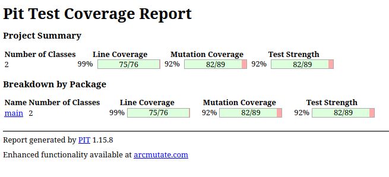

# Test the Date class

Implement a class `Date` with the interface shown below:

```java
class Date implements Comparable<Date> {

    public Date(int day, int month, int year) { ... }

    public static boolean isValidDate(int day, int month, int year) { ... }

    public static boolean isLeapYear(int year) { ... }

    public Date nextDate() { ... }

    public Date previousDate { ... }

    public int compareTo(Date other) { ... }

}
```

The constructor throws an exception if the three given integers do not form a valid date.

`isValidDate` returns `true` if the three integers form a valid year, otherwise `false`.

`isLeapYear` says if the given integer is a leap year.

`nextDate` returns a new `Date` instance representing the date of the following day.

`previousDate` returns a new `Date` instance representing the date of the previous day.

`compareTo` follows the `Comparable` convention:

* `date.compareTo(other)` returns a positive integer if `date` is posterior to `other`
* `date.compareTo(other)` returns a negative integer if `date` is anterior to `other`
* `date.compareTo(other)` returns `0` if `date` and `other` represent the same date.
* the method throws a `NullPointerException` if `other` is `null` 

Design and implement a test suite for this `Date` class.
You may use the test cases discussed in classes as a starting point. 
Also, feel free to add any extra method you may need to the `Date` class.


Use the following steps to design the test suite:

1. With the help of *Input Space Partitioning* design a set of initial test inputs for each method. Write below the characteristics and blocks you identified for each method. Specify which characteristics are common to more than one method.
2. Evaluate the statement coverage of the test cases designed in the previous step. If needed, add new test cases to increase the coverage. Describe below what you did in this step.
3. If you have in your code any predicate that uses more than two boolean operators check if the test cases written to far satisfy *Base Choice Coverage*. If needed add new test cases. Describe below how you evaluated the logic coverage and the new test cases you added.
4. Use PIT to evaluate the test suite you have so far. Describe below the mutation score and the live mutants. Add new test cases or refactor the existing ones to achieve a high mutation score.

Use the project in [tp3-date](../code/tp3-date) to complete this exercise.

## Answer

# Question 1
## 1. Constructor: `Date(int day, int month, int year)`

### **Blocks Identified**

Based on the above characteristics, we can define the following blocks:

1. **Valid Inputs:**
    - **Typical Dates:** Days within the valid range for the month.
    - **Leap Day:** February 29th in a leap year.

2. **Invalid Inputs:**
    - **Invalid Day:** Days <1 or > maximum days for the month.
    - **Invalid Month:** Months <1 or >12.
    - **Invalid Year:** Year <=0.
    - **Invalid Leap Day:** February 29th in a non-leap year.

3. **Boundary Cases:**
    - **Minimum Day:** 1.
    - **Maximum Day:** Last day of the month.
    - **Minimum Month:** 1 (January).
    - **Maximum Month:** 12 (December).
    - **Minimum Year:** 1.

---

## 2. Static Method: `isValidDate(int day, int month, int year)`

### **Blocks Identified**

The blocks are similar to those identified for the constructor, as both involve date validation.

1. **Valid Inputs:**
    - **Typical Dates:** Days within the valid range for the month.
    - **Leap Day:** February 29th in a leap year.

2. **Invalid Inputs:**
    - **Invalid Day:** Days <1 or > maximum days for the month.
    - **Invalid Month:** Months <1 or >12.
    - **Invalid Year:** Year <=0.
    - **Invalid Leap Day:** February 29th in a non-leap year.

3. **Boundary Cases:**
    - **Minimum Day:** 1.
    - **Maximum Day:** Last day of the month.
    - **Minimum Month:** 1 (January).
    - **Maximum Month:** 12 (December).
    - **Minimum Year:** 1.

---

## 3. Static Method: `isLeapYear(int year)`

### **Blocks Identified**

1. **Leap Years:**
    - **Divisible by 4 but not by 100.**
    - **Divisible by 400.**

2. **Non-Leap Years:**
    - **Not divisible by 4.**
    - **Divisible by 100 but not by 400.**

3. **Invalid Inputs:**
    - **Year <=0** (if applicable based on implementation).

---

## 4. Instance Method: `nextDate()`

### **Blocks Identified**

1. **Typical Increment:**
    - Dates that are not at the end of the month or year.

2. **End of Month:**
    - Transition to the first day of the next month.

3. **End of Year:**
    - Transition to the first day of the next year.

4. **Leap Year Considerations:**
    - February 28th in a leap year transitions to February 29th.
    - February 29th in a leap year transitions to March 1st.

5. **Boundary Cases:**
    - Minimum date handling.
    - Potential maximum date handling.

---

## 5. Instance Method: `previousDate()`

### **Blocks Identified**

1. **Typical Decrement:**
    - Dates that are not at the start of the month or year.

2. **Start of Month:**
    - Transition to the last day of the previous month.

3. **Start of Year:**
    - Transition to the last day of the previous year.

4. **Leap Year Considerations:**
    - March 1st in a leap year transitions to February 29th.
    - March 1st in a non-leap year transitions to February 28th.

5. **Boundary Cases:**
    - Minimum date handling.
    - Potential maximum date handling.

---

## 6. Instance Method: `compareTo(Date other)`

### **Blocks Identified**

1. **Equal Dates:**
    - Both dates have the same day, month, and year.

2. **Date A After Date B:**
    - Year of A > Year of B.
    - Year equal, month of A > month of B.
    - Year and month equal, day of A > day of B.

3. **Date A Before Date B:**
    - Year of A < Year of B.
    - Year equal, month of A < month of B.
    - Year and month equal, day of A < day of B.

4. **Null Comparison:**
    - `other` is `null` (should throw `NullPointerException`).

5. **Boundary Cases:**
    - Comparing dates at the edge of valid ranges.


# Question 2

## **Statement Coverage**

While the existing tests comprehensively covered many scenarios, certain statements, particularly those involving type checks and specific date validations, remained untested.

In the method getDaysInMonth, I didn't test the case where month = 11
```java
private static int getDaysInMonth(int month, int year) {
        return switch (month) {
            case 2 -> isLeapYear(year) ? 29 : 28;
            case 4, 6, 9, 11 -> 30;
            default -> 31;
        };
    }
```

In the equals method, the second 'if' condition was never evaluated to true

```java
@Override
    public boolean equals(Object obj) {
        if (this == obj) return true;
        if (!(obj instanceof Date other)) return false;
        return this.day == other.day &&
                this.month == other.month &&
                this.year == other.year;
    }
```

1. **Testing `equals` with Non-Date Objects:**
    ```java
    @Test
    void testEquals_WithNonDateObject() {
        Date date = new Date(15, 8, 2023);
        Object nonDateObject = new Object();
        assertFalse(date.equals(nonDateObject));
    }
    ```

2. **Testing `equals` with a `String` Object:**
    ```java
    @Test
    void testEquals_WithStringObject() {
        Date date = new Date(15, 8, 2023);
        String notADate = "15/08/2023";
        assertFalse(date.equals(notADate));
    }
    ```

3. **Validating November 30th and 31st:**
    ```java
    @Test
    void testIsValidDate_November30() {
        assertTrue(Date.isValidDate(30, 11, 2023));
        assertFalse(Date.isValidDate(31, 11, 2023));
    }
    ```

4. **Creating a Valid Date in November:**
    ```java
    @Test
    void testNovemberValidDateCreation() {
        Date date = new Date(30, 11, 2023);
        assertEquals("30/11/2023", date.toString());
    }
    ```

5. **Attempting to Create an Invalid Date in November:**
    ```java
    @Test
    void testNovemberInvalidDateCreation() {
        Exception exception = assertThrows(IllegalArgumentException.class, () -> new Date(31, 11, 2023));
        assertEquals("Invalid date provided.", exception.getMessage());
    }
    ```
After these changements, I have 100% coverage.

# Question 3 

Upon reviewing the `Date` class implementation, I identified predicates that incorporate more than two boolean operators. Specifically, the key areas with complex boolean logic include:

- **Constructor Validation:**
  ```java
  if (!isValidDate(day, month, year)) {
      throw new IllegalArgumentException("Invalid date provided.");
  }
  ```

- **Leap Year Determination:**
  ```java
  if (year % 4 != 0) {
      return false;
  } else if (year % 100 != 0) {
      return true;
  } else {
      return year % 400 == 0;
  }
  ```

- **Date Comparisons in `compareTo`:**
  ```java
  if (this.year != other.year) {
      return this.year - other.year;
  }
  
  if (this.month != other.month) {
      return this.month - other.month;
  }
  
  return this.day - other.day;
  ```

#### **Conclusion**

After a comprehensive review, I determined that **no additional test cases were necessary** to satisfy Base Choice Coverage for the `Date` class. The existing test suite already ensures that:

- Each operand in complex predicates is tested with its base (nominal) value.
- Other operands are held at their base values during these tests, isolating the behavior under scrutiny.


# Question 4 



When I first ran PIT, I obtained this results :

```
>> Line Coverage (for mutated classes only): 75/76 (99%)
>> Generated 89 mutations Killed 80 (90%)
>> Mutations with no coverage 0. Test strength 90%
>> Ran 243 tests (2.73 tests per mutation)
```

- **Mutation Score:** 90%
- **Killed Mutants:** 80 out of 89
- **Live Mutants:** 9

This initial analysis indicated that while the test suite was robust, there were still **9 mutants** that survived, suggesting areas where the test coverage could be further strengthened.

#### **Enhancing the Test Suite**

I added the following tests :

1. **`testEquals_WithNonDateObject`**
    ```java
    @Test
    void testEquals_WithNonDateObject() {
        Date date = new Date(15, 8, 2023);
        Object nonDateObject = new Object();
        assertFalse(date.equals(nonDateObject));
    }
    ```

2. **`testEquals_WithStringObject`**
    ```java
    @Test
    void testEquals_WithStringObject() {
        Date date = new Date(15, 8, 2023);
        String notADate = "15/08/2023";
        assertFalse(date.equals(notADate));
    }
    ```

3. **`testIsValidDate_November30`**
    ```java
    @Test
    void testIsValidDate_November30() {
        assertTrue(Date.isValidDate(30, 11, 2023));
        assertFalse(Date.isValidDate(31, 11, 2023));
    }
    ```

4. **`testNovemberValidDateCreation`**
    ```java
    @Test
    void testNovemberValidDateCreation() {
        Date date = new Date(30, 11, 2023);
        assertEquals("30/11/2023", date.toString());
    }
    ```

5. **`testNovemberInvalidDateCreation`**
    ```java
    @Test
    void testNovemberInvalidDateCreation() {
        Exception exception = assertThrows(IllegalArgumentException.class, () -> new Date(31, 11, 2023));
        assertEquals("Invalid date provided.", exception.getMessage());
    }
    ```

#### **Updated Mutation Analysis**

After integrating the above test cases, I reran PIT to evaluate the impact on the mutation coverage. The updated results are as follows:

```
>> Line Coverage (for mutated classes only): 75/76 (99%)
>> Generated 89 mutations Killed 82 (92%)
>> Mutations with no coverage 0. Test strength 92%
>> Ran 243 tests (2.73 tests per mutation)
```

- **Mutation Score:** 92%
- **Killed Mutants:** 82 out of 89
- **Live Mutants:** 7

**Improvements Observed:**

1. **Increased Mutation Score:** The mutation score improved from **90% to 92%**, indicating enhanced test effectiveness.
2. **Reduction in Live Mutants:** The number of surviving mutants decreased from **9 to 7**, demonstrating that the newly added tests successfully detected additional faults.
3. **Comprehensive Coverage:** The added tests specifically targeted the remaining live mutants, particularly those related to type checking in the `equals` method and boundary conditions for month validations.